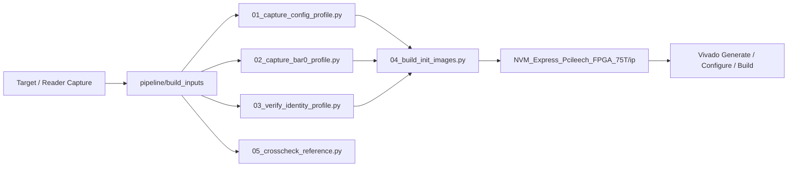
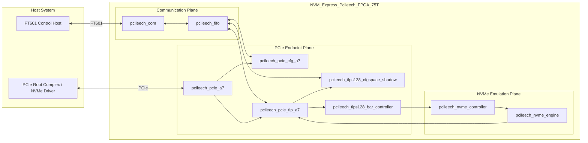
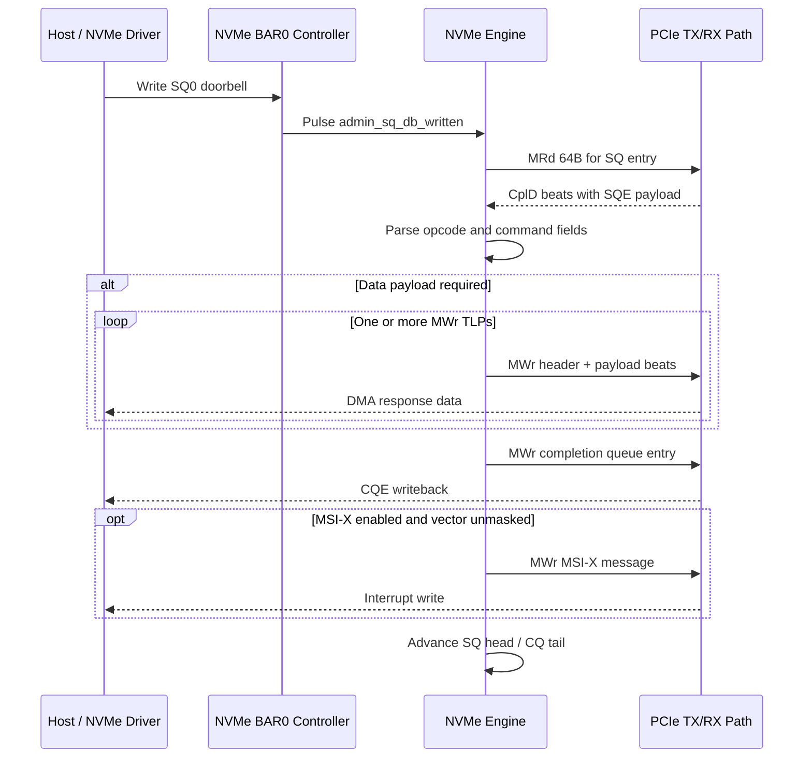
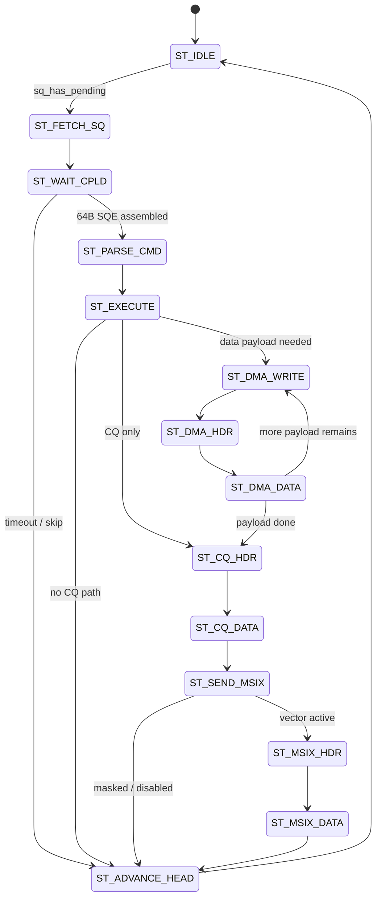

<div align="center">

# NVM_Express_Pcileech_FPGA_75T

<p><strong>Compact 75T NVMe FPGA project with a cleaned workflow, structured build inputs, and engineering-style runtime documentation.</strong></p>

[](https://discord.gg/sXcQhxa8qy)
[](https://discord.gg/sXcQhxa8qy)
[](./README.zh-CN.md)


</div>

> Contact: [Moer2831](https://discord.gg/sXcQhxa8qy)  
> Community: [discord.gg/sXcQhxa8qy](https://discord.gg/sXcQhxa8qy)  
> Language: [English](./README.md) | [中文](./README.zh-CN.md)

## Snapshot

- Board project directory: `NVM_Express_Pcileech_FPGA_75T/`
- Vivado project name: `NVM_Express_Pcileech_FPGA_75T`
- Top module: `nvm_express_pcileech_fpga_75t_top`
- Build output: `NVM_Express_Pcileech_FPGA_75T/NVM_Express_Pcileech_FPGA_75T.bin`
- Build inputs workspace: `pipeline/build_inputs/`

## Repository Layout

```text
NVM_Express_Pcileech_FPGA_75T/
  src/
    nvm_express_pcileech_fpga_75t_top.sv
    nvm_express_pcileech_fpga_75t.xdc
    pcileech_com.sv
    pcileech_fifo.sv
    pcileech_pcie_a7.sv
    pcileech_tlps128_cfgspace_shadow.sv
    pcileech_tlps128_bar_controller.sv
    pcileech_nvme_controller.sv
    pcileech_nvme_engine.sv
  ip/
    nvmexp_cfgspace.coe
    nvmexp_cfgspace_mask.coe
    nvmexp_bar0.coe
    nvme_identify_ctrl.hex
    nvme_identify_ns.hex
  vivado_generate_project_75t.tcl
  vivado_configure_profile_75t.tcl
  vivado_build_75t.tcl

pipeline/
  01_capture_config_profile.py
  02_capture_bar0_profile.py
  03_verify_identity_profile.py
  04_build_init_images.py
  05_crosscheck_reference.py
  target_collect_configspace.ps1
  target_collect_profile.ps1
  build_inputs/
```

## Module Roles

| Module | Role | Key Interfaces |
| --- | --- | --- |
| `nvm_express_pcileech_fpga_75t_top` | Board shell, reset generation, LED wiring, FT601 and PCIe top-level hookup | `clk`, `ft601_clk`, PCIe fabric, FT601 pads |
| `pcileech_com` | FT601 communication bridge, 32-bit to 64-bit packing, clock crossing into system domain | `clk_com -> clk`, `IfComToFifo` |
| `pcileech_fifo` | Command/TLP/config routing between communication core and PCIe subsystems | `IfComToFifo`, `IfPCIeFifo*`, `IfShadow2Fifo` |
| `pcileech_pcie_a7` | PCIe endpoint wrapper, link-stable gating, PCIe user clock domain, NVMe TX mux integration | Xilinx `pcie_7x_0`, `IfAXIS128` |
| `pcileech_tlps128_cfgspace_shadow` | Shadow config-space BRAM path for config read/write forwarding and host-side replay | config TLP stream, shadow FIFO |
| `pcileech_tlps128_bar_controller` | BAR read/write engines, BAR dispatch, BAR0 NVMe register file hookup | BAR TLP decode, read/write engines |
| `pcileech_nvme_controller` | BAR0 register map, CC/CSTS/AQA/ASQ/ACQ handling, doorbells, MSI-X table storage | BAR0 accesses, engine control outputs |
| `pcileech_nvme_engine` | Admin SQ fetch, command parse/execute, DMA write generation, CQ writeback, MSI-X trigger | raw RX completions, TX AXIS output |

## Build Inputs Workflow

The build pipeline is split from the FPGA project for a clearer data-to-build flow.



## Runtime Architecture

At runtime the FPGA design splits into three practical planes:

- Communication plane: FT601 host bridge and FIFO transport.
- PCIe endpoint plane: Xilinx PCIe core, config-space shadowing, and BAR TLP handling.
- NVMe emulation plane: BAR0 register file, admin queue engine, completion generation, and MSI-X signaling.



## Detailed Runtime Workflow

### 1. Board Bring-Up

- `nvm_express_pcileech_fpga_75t_top` generates reset and wires FT601, FIFO, and PCIe blocks.
- `pcileech_pcie_a7` holds the PCIe subsystem behind a link-stable delay gate.
- The holdoff prevents early bus-master activity before the platform is ready.

### 2. Config-Space Handling

- Standard config accesses are mediated by the Xilinx PCIe core and management path.
- Forwarded config TLPs can be served by `pcileech_tlps128_cfgspace_shadow`.
- Shadow config contents live in BRAM initialized from `nvmexp_cfgspace.coe` plus the write-mask image.

### 3. BAR0 Register Handling

- BAR memory TLPs are classified by `pcileech_tlps128_bar_controller`.
- BAR0 requests are routed into `pcileech_nvme_controller`.
- BAR0 reads return emulated controller values, while BAR0 writes update control registers, queue pointers, doorbells, and MSI-X table entries.

### 4. Admin Queue Execution

- When the host updates SQ0 tail, `pcileech_nvme_controller` raises `admin_sq_db_written`.
- `pcileech_nvme_engine` issues an MRd to fetch the 64-byte submission queue entry.
- CplD beats are collected into the local SQ buffer.
- The engine parses opcode, PRP1, CDW10, and CDW11.
- Depending on the command, the engine selects an internal response source, emits DMA writes, writes a CQ entry, and optionally emits an MSI-X write.

### 5. Data Return Paths

- Identify payloads are sourced from `nvme_identify_ctrl.hex` and `nvme_identify_ns.hex`.
- Config-space shadow data is BRAM-backed.
- BAR0 state is register-backed.
- TLP responses are multiplexed back into the PCIe transmit stream through `pcileech_pcie_tlp_a7`.

## Clock Domains

| Domain | Source | Main Blocks | Purpose |
| --- | --- | --- | --- |
| `clk` | 100 MHz board clock | `pcileech_fifo`, top-level control, FT601 system-side buffering | system control plane |
| `ft601_clk` / `clk_com` | FT601 interface clock | `pcileech_com`, `pcileech_ft601` | communication I/O domain |
| `clk_pcie` | PCIe user clock from `pcie_7x_0` | `pcileech_pcie_a7`, config shadow, BAR engine, NVMe engine | live PCIe transaction domain |

## Transaction Timing

The most important runtime path is the admin command loop. The diagram below maps the actual engine flow used for Identify, Get Log Page, and similar admin commands.



## NVMe Engine State Flow

The internal admin engine in `pcileech_nvme_engine.sv` uses the following execution chain:



## Build Flow

### 1. Generate the Vivado project

```tcl
cd NVM_Express_Pcileech_FPGA_75T
source vivado_generate_project_75t.tcl -notrace
```

### 2. Apply the PCIe profile configuration

```tcl
source vivado_configure_profile_75t.tcl
```

### 3. Build the bitstream

```tcl
source vivado_build_75t.tcl -notrace
```

Expected output:

```text
NVM_Express_Pcileech_FPGA_75T/NVM_Express_Pcileech_FPGA_75T.bin
```

## Build Inputs Commands

Place reference files in:

```text
pipeline/build_inputs/
```

Then run:

```powershell
python pipeline/01_capture_config_profile.py
python pipeline/02_capture_bar0_profile.py
python pipeline/03_verify_identity_profile.py
python pipeline/04_build_init_images.py
python pipeline/05_crosscheck_reference.py
```


