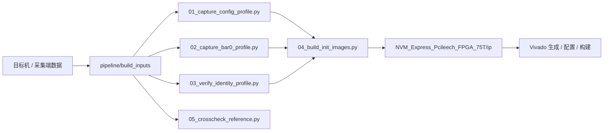
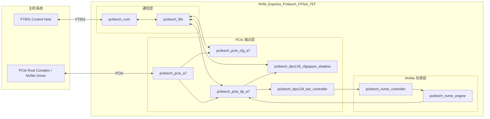
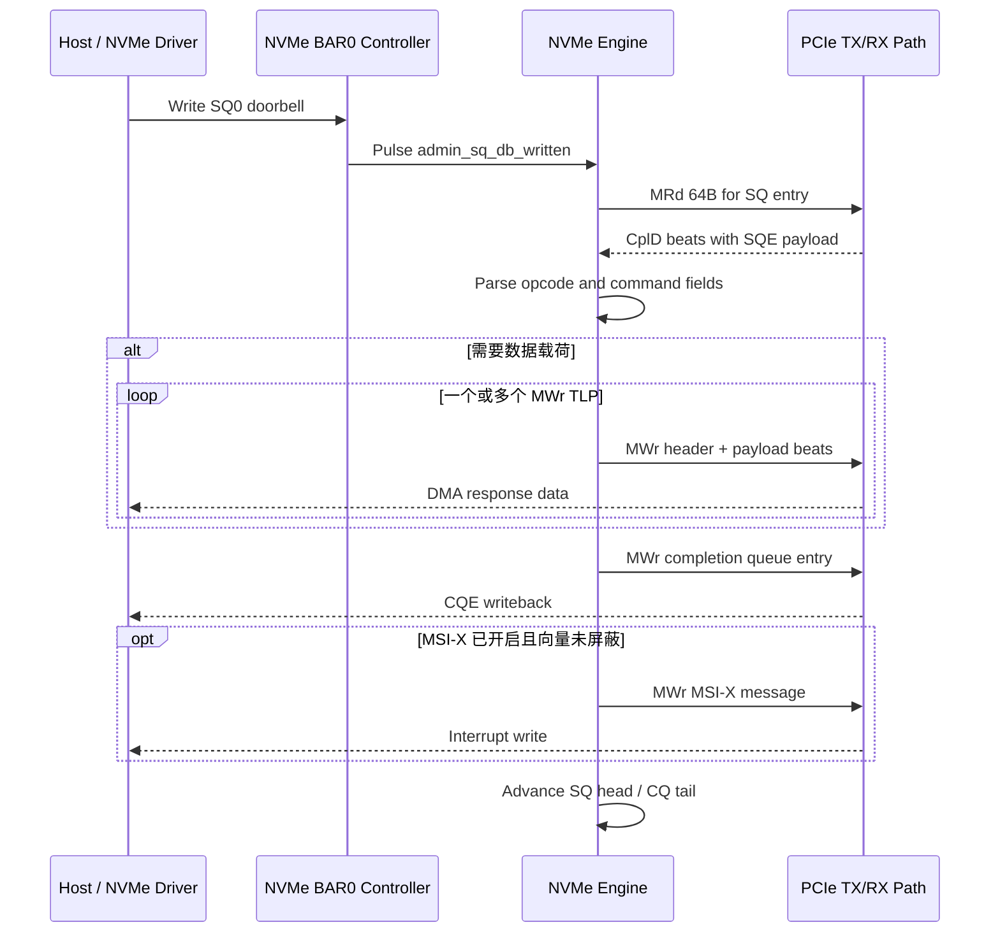
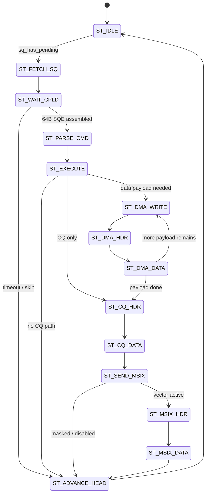

<div align="center">

# NVM_Express_Pcileech_FPGA_75T

<p><strong>面向 75T 板卡的 NVMe FPGA 工程，包含整理后的工作流、统一后的工程命名，以及偏工程说明书风格的模块结构、工作链路和时序说明。</strong></p>

[](https://discord.gg/sXcQhxa8qy)
[](https://discord.gg/sXcQhxa8qy)
[](./README.md)


</div>

> 联系方式：[Moer2831](https://discord.gg/sXcQhxa8qy)  
> 社区链接：[discord.gg/sXcQhxa8qy](https://discord.gg/sXcQhxa8qy)  
> 文档语言：[中文](./README.zh-CN.md) | [English](./README.md)

## 项目速览

- 板级工程目录：`NVM_Express_Pcileech_FPGA_75T/`
- Vivado 工程名：`NVM_Express_Pcileech_FPGA_75T`
- 顶层模块：`nvm_express_pcileech_fpga_75t_top`
- 构建输出：`NVM_Express_Pcileech_FPGA_75T/NVM_Express_Pcileech_FPGA_75T.bin`
- 构建输入目录：`pipeline/build_inputs/`

## 仓库结构

```text
NVM_Express_Pcileech_FPGA_75T/
  src/
    nvm_express_pcileech_fpga_75t_top.sv
    nvm_express_pcileech_fpga_75t.xdc
    pcileech_com.sv
    pcileech_fifo.sv
    pcileech_pcie_a7.sv
    pcileech_tlps128_cfgspace_shadow.sv
    pcileech_tlps128_bar_controller.sv
    pcileech_nvme_controller.sv
    pcileech_nvme_engine.sv
  ip/
    nvmexp_cfgspace.coe
    nvmexp_cfgspace_mask.coe
    nvmexp_bar0.coe
    nvme_identify_ctrl.hex
    nvme_identify_ns.hex
  vivado_generate_project_75t.tcl
  vivado_configure_profile_75t.tcl
  vivado_build_75t.tcl

pipeline/
  01_capture_config_profile.py
  02_capture_bar0_profile.py
  03_verify_identity_profile.py
  04_build_init_images.py
  05_crosscheck_reference.py
  target_collect_configspace.ps1
  target_collect_profile.ps1
  build_inputs/
```

## 核心模块职责

| 模块 | 作用 | 关键接口 |
| --- | --- | --- |
| `nvm_express_pcileech_fpga_75t_top` | 板级封装、复位生成、LED 连接、FT601 与 PCIe 顶层布线 | `clk`、`ft601_clk`、PCIe fabric、FT601 pads |
| `pcileech_com` | FT601 通信桥、32 位到 64 位打包、跨时钟域送入系统域 | `clk_com -> clk`、`IfComToFifo` |
| `pcileech_fifo` | 通信侧与 PCIe 子系统之间的命令/TLP/配置路由 | `IfComToFifo`、`IfPCIeFifo*`、`IfShadow2Fifo` |
| `pcileech_pcie_a7` | PCIe 端点包装、链路稳定延时门控、用户时钟域、NVMe 发包接入 | Xilinx `pcie_7x_0`、`IfAXIS128` |
| `pcileech_tlps128_cfgspace_shadow` | Shadow config-space BRAM 路径，负责配置转发与重放 | config TLP stream、shadow FIFO |
| `pcileech_tlps128_bar_controller` | BAR 读写引擎、BAR 分发、BAR0 NVMe 寄存器入口 | BAR TLP decode、read/write engines |
| `pcileech_nvme_controller` | BAR0 寄存器映射、CC/CSTS/AQA/ASQ/ACQ、doorbell、MSI-X 表存储 | BAR0 访问、对 engine 的控制输出 |
| `pcileech_nvme_engine` | Admin SQ 抓取、命令解析执行、DMA 写回、CQ 写回、MSI-X 触发 | 原始 completion、TX AXIS 输出 |

## 构建输入工作流

构建流程与 FPGA 工程本体拆开，便于整理构建输入到构建产物的转换链路。



## 运行时架构图

运行时可以把工程拆成三层：

- 通信层：FT601 主机桥与 FIFO 传输层。
- PCIe 端点层：Xilinx PCIe Core、config shadow、BAR TLP 处理。
- NVMe 仿真层：BAR0 寄存器、Admin Queue 引擎、CQ 写回和 MSI-X。



## 详细运行流程

### 1. 上电与链路建立

- `nvm_express_pcileech_fpga_75t_top` 负责板级复位和总连接。
- `pcileech_pcie_a7` 在链路拉起后还会加一段稳定延时门控。
- 这个门控用于避免平台尚未准备好时过早发起 bus-master TLP。

### 2. 配置空间访问

- 标准配置访问先由 Xilinx PCIe Core 管理路径处理。
- 如果配置 TLP 被转发到用户逻辑，则由 `pcileech_tlps128_cfgspace_shadow` 接手。
- Shadow config 数据来自 BRAM，初始化内容由 `nvmexp_cfgspace.coe` 和写掩码共同定义。

### 3. BAR0 寄存器访问

- BAR Memory TLP 先由 `pcileech_tlps128_bar_controller` 分类。
- BAR0 请求进入 `pcileech_nvme_controller`。
- BAR0 读返回仿真的控制器寄存器值，BAR0 写则更新控制位、队列基址、doorbell 和 MSI-X 表项。

### 4. Admin Queue 执行链

- 主机更新 SQ0 tail 后，`pcileech_nvme_controller` 拉起 `admin_sq_db_written`。
- `pcileech_nvme_engine` 发起一次 64B MRd 去抓取 Submission Queue Entry。
- CplD 数据被拼成完整 SQE，随后解析 opcode、PRP1、CDW10、CDW11。
- 根据命令类型选择内部数据源，执行 DMA 写回、写 CQ Entry，并在需要时再发 MSI-X。

### 5. 数据回送路径

- Identify 数据来自 `nvme_identify_ctrl.hex` 与 `nvme_identify_ns.hex`。
- Shadow config 数据来自 BRAM。
- BAR0 状态来自寄存器文件。
- 最终返回主机的 TLP 由 `pcileech_pcie_tlp_a7` 汇入 PCIe 发送通道。

## 时钟域划分

| 时钟域 | 来源 | 主要模块 | 用途 |
| --- | --- | --- | --- |
| `clk` | 100 MHz 板载时钟 | `pcileech_fifo`、顶层控制、FT601 系统侧缓存 | 系统控制面 |
| `ft601_clk` / `clk_com` | FT601 接口时钟 | `pcileech_com`、`pcileech_ft601` | 通信 I/O 域 |
| `clk_pcie` | `pcie_7x_0` 导出的 62.5 MHz PCIe 用户时钟 | `pcileech_pcie_a7`、config shadow、BAR 引擎、NVMe 引擎 | 在线 PCIe 事务域 |

当前工程配置使用的是 62.5 MHz PCIe 用户域时钟。Vivado 配置脚本里把 `CONFIG.User_Clk_Freq` 设为 `62.5`，而且 RTL 里多处 PCIe 侧延时/计数常量也是按这个频率计算的。

## 事务时序图

最重要的运行时路径是 Admin Command 执行链。下面这张图对应 Identify、Get Log Page 等管理命令的执行路径。



## NVMe Engine 状态流

`pcileech_nvme_engine.sv` 内部 Admin 引擎的状态流如下：



## 构建流程

### 1. 生成 Vivado 工程

```tcl
cd NVM_Express_Pcileech_FPGA_75T
source vivado_generate_project_75t.tcl -notrace
```

### 2. 应用 PCIe Profile 配置

```tcl
source vivado_configure_profile_75t.tcl
```

### 3. 构建 bitstream

```tcl
source vivado_build_75t.tcl -notrace
```

输出文件：

```text
NVM_Express_Pcileech_FPGA_75T/NVM_Express_Pcileech_FPGA_75T.bin
```

## 构建输入命令

请把构建输入放到：

```text
pipeline/build_inputs/
```

然后执行：

```powershell
python pipeline/01_capture_config_profile.py
python pipeline/02_capture_bar0_profile.py
python pipeline/03_verify_identity_profile.py
python pipeline/04_build_init_images.py
python pipeline/05_crosscheck_reference.py
```

